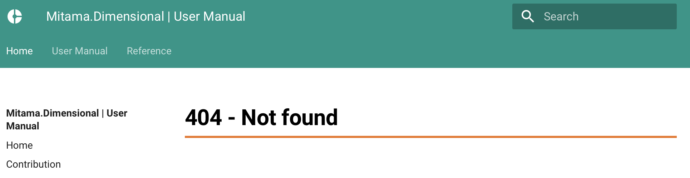
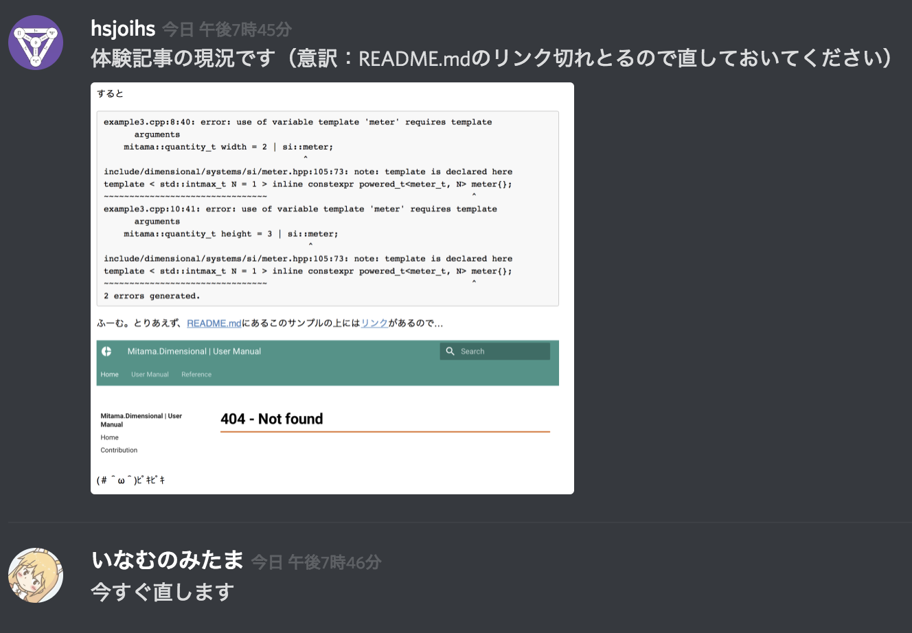

## 執筆者の環境

```
$ clang++ --version
clang version 7.0.0 (tags/RELEASE_700/final)
Target: x86_64-apple-darwin17.7.0
Thread model: posix
InstalledDir: /Users/admin/clang+llvm-7.0.0-x86_64-apple-darwin/bin
```

## やっていき

まず Mitama.Dimensionalを[https://github.com/LoliGothick/mitama-dimensional](https://github.com/LoliGothick/mitama-dimensional) からダウンロードしてきて、`include/`を自分のプロジェクトの`include/`にコピー。header-onlyなライブラリなのでこれでいいはず。

とりあえず[README.md](https://github.com/LoliGothick/mitama-dimensional/blob/94071ad7b412a321aac4187f72b9d0664663de8e/README.md)のExampleのトップにあるやつでも持ってくる。

```cpp
#include <dimensional/quantity.hpp>
#include <dimensional/systems/si/all.hpp>
#include <dimensional/systems/si/derived_units/area.hpp>

int main()
{
    namespace si = mitama::systems::si;
    // width = 2 m
    mitama::quantity_t<si::meter_t, int> width = 2;
    // height = 3 m
    mitama::quantity_t<si::meter_t, int> height = 3;
    // area = 6 m^2
    mitama::quantity_t<si::area_t, int> area = width * height;
}
```

これを

```
$ clang++ example1.cpp
```

すると当然

```
example1.cpp:1:10: fatal error: 'dimensional/quantity.hpp' file not found
#include <dimensional/quantity.hpp>
         ^~~~~~~~~~~~~~~~~~~~~~~~~~
1 error generated.
```

である。clang++はMitama.Dimensionalを知らないので当然である。ということでincludeを設定する必要がある。[clang公式](https://clang.llvm.org/docs/ClangCommandLineReference.html#include-path-management)を見に行くと、`--include-directory`を指定してやればよいと書いてある。

```
$ clang++ example1.cpp --include-directory include/
```

すると

```
In file included from example1.cpp:1:
In file included from include/dimensional/quantity.hpp:3:
include/dimensional/fwd/quantity_fwd.hpp:5:23: error: 'auto' not allowed in
      template parameter until C++17
    template < class, auto >
                      ^~~~
include/dimensional/fwd/quantity_fwd.hpp:8:27: error: 'auto' not allowed in
      template parameter until C++17
    template < template < auto > class, class >
                          ^~~~
In file included from example1.cpp:1:
In file included from include/dimensional/quantity.hpp:4:
In file included from include/dimensional/dimensional_traits.hpp:6:
include/dimensional/mitamagic/type_traits_ext.hpp:11:23: warning: inline
      variables are a C++17 extension [-Wc++17-extensions]
template < class... > inline constexpr bool always_false_v = false;
                      ^
include/dimensional/mitamagic/type_traits_ext.hpp:16:33: error: no template
      named 'void_t' in namespace 'std'; did you mean '__void_t'?
struct is_complete_type<T, std::void_t<decltype(sizeof(T))>> : std::true...
                           ~~~~~^~~~~~
                                __void_t
/Users/admin/clang+llvm-7.0.0-x86_64-apple-darwin/include/c++/v1/type_traits:415:8: note: 
      '__void_t' declared here
struct __void_t { typedef void type; };
       ^
In file included from example1.cpp:1:
In file included from include/dimensional/quantity.hpp:4:
In file included from include/dimensional/dimensional_traits.hpp:6:
include/dimensional/mitamagic/type_traits_ext.hpp:18:20: warning: inline
      variables are a C++17 extension [-Wc++17-extensions]
template <class T> inline constexpr bool is_complete_type_v = is_complet...
                   ^
include/dimensional/mitamagic/type_traits_ext.hpp:24:43: error: no template
      named 'void_t' in namespace 'std'; did you mean '__void_t'?
struct is_less_comparable_with<T, U, std::void_t<decltype(std::declval<...
                                     ~~~~~^~~~~~
                                          __void_t
/Users/admin/clang+llvm-7.0.0-x86_64-apple-darwin/include/c++/v1/type_traits:415:8: note: 
      '__void_t' declared here
struct __void_t { typedef void type; };
       ^
In file included from example1.cpp:1:
In file included from include/dimensional/quantity.hpp:4:
In file included from include/dimensional/dimensional_traits.hpp:6:
include/dimensional/mitamagic/type_traits_ext.hpp:33:46: error: no template
      named 'void_t' in namespace 'std'; did you mean '__void_t'?
struct is_greater_comparable_with<T, U, std::void_t<decltype(std::declva...
                                        ~~~~~^~~~~~
                                             __void_t
/Users/admin/clang+llvm-7.0.0-x86_64-apple-darwin/include/c++/v1/type_traits:415:8: note: 
      '__void_t' declared here
struct __void_t { typedef void type; };
       ^
In file included from example1.cpp:1:
In file included from include/dimensional/quantity.hpp:4:
In file included from include/dimensional/dimensional_traits.hpp:6:
include/dimensional/mitamagic/type_traits_ext.hpp:42:52: error: no template
      named 'void_t' in namespace 'std'; did you mean '__void_t'?
struct is_less_or_equal_comparable_with<T, U, std::void_t<decltype(std::...
                                              ~~~~~^~~~~~
                                                   __void_t
/Users/admin/clang+llvm-7.0.0-x86_64-apple-darwin/include/c++/v1/type_traits:415:8: note: 
      '__void_t' declared here
struct __void_t { typedef void type; };
       ^
In file included from example1.cpp:1:
In file included from include/dimensional/quantity.hpp:4:
In file included from include/dimensional/dimensional_traits.hpp:6:
include/dimensional/mitamagic/type_traits_ext.hpp:51:55: error: no template
      named 'void_t' in namespace 'std'; did you mean '__void_t'?
struct is_greater_or_equal_comparable_with<T, U, std::void_t<decltype(st...
                                                 ~~~~~^~~~~~
                                                      __void_t
/Users/admin/clang+llvm-7.0.0-x86_64-apple-darwin/include/c++/v1/type_traits:415:8: note: 
      '__void_t' declared here
struct __void_t { typedef void type; };
       ^
In file included from example1.cpp:1:
In file included from include/dimensional/quantity.hpp:4:
In file included from include/dimensional/dimensional_traits.hpp:6:
include/dimensional/mitamagic/type_traits_ext.hpp:60:44: error: no template
      named 'void_t' in namespace 'std'; did you mean '__void_t'?
struct is_equal_comparable_with<T, U, std::void_t<decltype(std::declval<...
                                      ~~~~~^~~~~~
                                           __void_t
/Users/admin/clang+llvm-7.0.0-x86_64-apple-darwin/include/c++/v1/type_traits:415:8: note: 
      '__void_t' declared here
struct __void_t { typedef void type; };
       ^
In file included from example1.cpp:1:
In file included from include/dimensional/quantity.hpp:4:
In file included from include/dimensional/dimensional_traits.hpp:6:
include/dimensional/mitamagic/type_traits_ext.hpp:69:47: error: no template
      named 'void_t' in namespace 'std'; did you mean '__void_t'?
struct is_notequal_comparable_with<T, U, std::void_t<decltype(std::declv...
                                         ~~~~~^~~~~~
                                              __void_t
/Users/admin/clang+llvm-7.0.0-x86_64-apple-darwin/include/c++/v1/type_traits:415:8: note: 
      '__void_t' declared here
struct __void_t { typedef void type; };
       ^
In file included from example1.cpp:1:
In file included from include/dimensional/quantity.hpp:4:
In file included from include/dimensional/dimensional_traits.hpp:6:
include/dimensional/mitamagic/type_traits_ext.hpp:78:35: error: no template
      named 'void_t' in namespace 'std'; did you mean '__void_t'?
struct is_addable_with<T, U, std::void_t<decltype(std::declval<T const&>...
                             ~~~~~^~~~~~
                                  __void_t
/Users/admin/clang+llvm-7.0.0-x86_64-apple-darwin/include/c++/v1/type_traits:415:8: note: 
      '__void_t' declared here
struct __void_t { typedef void type; };
       ^
In file included from example1.cpp:1:
In file included from include/dimensional/quantity.hpp:4:
In file included from include/dimensional/dimensional_traits.hpp:6:
include/dimensional/mitamagic/type_traits_ext.hpp:84:1: warning: inline
      variables are a C++17 extension [-Wc++17-extensions]
inline constexpr bool is_addable_with_v = is_addable_with<T, U>::value;
^
include/dimensional/mitamagic/type_traits_ext.hpp:87:1: warning: inline
      variables are a C++17 extension [-Wc++17-extensions]
inline constexpr bool is_addable_v = is_addable<T>::value;
^
include/dimensional/mitamagic/type_traits_ext.hpp:93:40: error: no template
      named 'void_t' in namespace 'std'; did you mean '__void_t'?
struct is_subtractible_with<T, U, std::void_t<decltype(std::declval<T co...
                                  ~~~~~^~~~~~
                                       __void_t
/Users/admin/clang+llvm-7.0.0-x86_64-apple-darwin/include/c++/v1/type_traits:415:8: note: 
      '__void_t' declared here
struct __void_t { typedef void type; };
       ^
In file included from example1.cpp:1:
In file included from include/dimensional/quantity.hpp:4:
In file included from include/dimensional/dimensional_traits.hpp:6:
include/dimensional/mitamagic/type_traits_ext.hpp:99:1: warning: inline
      variables are a C++17 extension [-Wc++17-extensions]
inline constexpr bool is_subtractible_with_v = is_subtractible_with<T, U...
^
include/dimensional/mitamagic/type_traits_ext.hpp:102:1: warning: inline
      variables are a C++17 extension [-Wc++17-extensions]
inline constexpr bool is_subtractible_v = is_subtractible<T>::value;
^
include/dimensional/mitamagic/type_traits_ext.hpp:108:40: error: no template
      named 'void_t' in namespace 'std'; did you mean '__void_t'?
struct is_multipliable_with<T, U, std::void_t<decltype(std::declval<T co...
                                  ~~~~~^~~~~~
                                       __void_t
/Users/admin/clang+llvm-7.0.0-x86_64-apple-darwin/include/c++/v1/type_traits:415:8: note: 
      '__void_t' declared here
struct __void_t { typedef void type; };
       ^
In file included from example1.cpp:1:
In file included from include/dimensional/quantity.hpp:4:
In file included from include/dimensional/dimensional_traits.hpp:6:
include/dimensional/mitamagic/type_traits_ext.hpp:114:1: warning: inline
      variables are a C++17 extension [-Wc++17-extensions]
inline constexpr bool is_multipliable_with_v = is_multipliable_with<T, U...
^
include/dimensional/mitamagic/type_traits_ext.hpp:117:1: warning: inline
      variables are a C++17 extension [-Wc++17-extensions]
inline constexpr bool is_multipliable_v = is_multipliable<T>::value;
^
include/dimensional/mitamagic/type_traits_ext.hpp:123:37: error: no template
      named 'void_t' in namespace 'std'; did you mean '__void_t'?
struct is_dividable_with<T, U, std::void_t<decltype(std::declval<T const...
                               ~~~~~^~~~~~
                                    __void_t
/Users/admin/clang+llvm-7.0.0-x86_64-apple-darwin/include/c++/v1/type_traits:415:8: note: 
      '__void_t' declared here
struct __void_t { typedef void type; };
       ^
In file included from example1.cpp:1:
In file included from include/dimensional/quantity.hpp:4:
In file included from include/dimensional/dimensional_traits.hpp:6:
include/dimensional/mitamagic/type_traits_ext.hpp:129:1: warning: inline
      variables are a C++17 extension [-Wc++17-extensions]
inline constexpr bool is_dividable_with_v = is_dividable_with<T, U>::value;
^
include/dimensional/mitamagic/type_traits_ext.hpp:132:1: warning: inline
      variables are a C++17 extension [-Wc++17-extensions]
inline constexpr bool is_dividable_v = is_dividable<T>::value;
^
In file included from example1.cpp:1:
In file included from include/dimensional/quantity.hpp:4:
In file included from include/dimensional/dimensional_traits.hpp:7:
include/dimensional/mitamagic/type_list.hpp:8:17: warning: nested namespace
      definition is a C++17 extension; define each namespace separately
      [-Wc++17-extensions]
namespace mitama::mitamagic {
                ^~~~~~~~~~~
                 { namespace mitamagic
include/dimensional/mitamagic/type_list.hpp:15:1: warning: inline variables are
      a C++17 extension [-Wc++17-extensions]
inline constexpr bool tlist_containts_v = std::is_base_of_v<T, TypeList>;
^
include/dimensional/mitamagic/type_list.hpp:15:48: error: no template named
      'is_base_of_v' in namespace 'std'; did you mean 'is_base_of'?
inline constexpr bool tlist_containts_v = std::is_base_of_v<T, TypeList>;
                                          ~~~~~^~~~~~~~~~~~
                                               is_base_of
/Users/admin/clang+llvm-7.0.0-x86_64-apple-darwin/include/c++/v1/type_traits:1418:29: note: 
      'is_base_of' declared here
struct _LIBCPP_TEMPLATE_VIS is_base_of
                            ^
In file included from example1.cpp:1:
In file included from include/dimensional/quantity.hpp:4:
In file included from include/dimensional/dimensional_traits.hpp:7:
include/dimensional/mitamagic/type_list.hpp:15:73: error: expected '(' for
      function-style cast or type construction
inline constexpr bool tlist_containts_v = std::is_base_of_v<T, TypeList>;
                                          ~~~~~~~~~~~~~~~~~~~~~~~~~~~~~~^
include/dimensional/mitamagic/type_list.hpp:93:12: error: unknown template name
      'conjunction'
    : std::conjunction<Pred<Args>...> {};
           ^
include/dimensional/mitamagic/type_list.hpp:96:1: warning: inline variables are
      a C++17 extension [-Wc++17-extensions]
inline constexpr bool tlist_all_match_if_v =
^
In file included from example1.cpp:1:
In file included from include/dimensional/quantity.hpp:4:
In file included from include/dimensional/dimensional_traits.hpp:9:
In file included from include/dimensional/mitamagic/quotient.hpp:3:
In file included from include/dimensional/dimensional_phantom.hpp:6:
include/dimensional/mitamagic/ratio_ext.hpp:6:17: warning: nested namespace
      definition is a C++17 extension; define each namespace separately
      [-Wc++17-extensions]
namespace mitama::mitamagic {
                ^~~~~~~~~~~
                 { namespace mitamagic
include/dimensional/mitamagic/ratio_ext.hpp:14:20: warning: inline variables are
      a C++17 extension [-Wc++17-extensions]
template <class T> inline constexpr bool is_rational_v = is_rational<T>::value;
                   ^
include/dimensional/mitamagic/ratio_ext.hpp:17:43: error: no template named
      'ratio_greater_v' in namespace 'std'; did you mean 'ratio_greater'?
using ratio_max = std::conditional_t<std::ratio_greater_v<R1, R2>, R1, R2>;
                                     ~~~~~^~~~~~~~~~~~~~~
                                          ratio_greater
/Users/admin/clang+llvm-7.0.0-x86_64-apple-darwin/include/c++/v1/ratio:489:29: note: 
      'ratio_greater' declared here
struct _LIBCPP_TEMPLATE_VIS ratio_greater
                            ^
In file included from example1.cpp:1:
In file included from include/dimensional/quantity.hpp:4:
In file included from include/dimensional/dimensional_traits.hpp:9:
In file included from include/dimensional/mitamagic/quotient.hpp:3:
In file included from include/dimensional/dimensional_phantom.hpp:6:
include/dimensional/mitamagic/ratio_ext.hpp:17:38: error: template argument for
      non-type template parameter must be an expression
using ratio_max = std::conditional_t<std::ratio_greater_v<R1, R2>, R1, R2>;
                                     ^~~~~~~~~~~~~~~~~~~~~~~~~~~~
/Users/admin/clang+llvm-7.0.0-x86_64-apple-darwin/include/c++/v1/type_traits:429:16: note: 
      template parameter is declared here
template <bool _Bp, class _If, class _Then> using conditional_t = typena...
               ^
In file included from example1.cpp:1:
In file included from include/dimensional/quantity.hpp:4:
In file included from include/dimensional/dimensional_traits.hpp:9:
In file included from include/dimensional/mitamagic/quotient.hpp:3:
In file included from include/dimensional/dimensional_phantom.hpp:6:
include/dimensional/mitamagic/ratio_ext.hpp:20:43: error: no template named
      'ratio_less_v' in namespace 'std'; did you mean 'ratio_less'?
using ratio_min = std::conditional_t<std::ratio_less_v<R1, R2>, R1, R2>;
                                     ~~~~~^~~~~~~~~~~~
                                          ratio_less
/Users/admin/clang+llvm-7.0.0-x86_64-apple-darwin/include/c++/v1/ratio:481:29: note: 
      'ratio_less' declared here
struct _LIBCPP_TEMPLATE_VIS ratio_less
                            ^
fatal error: too many errors emitted, stopping now [-ferror-limit=]
15 warnings and 20 errors generated.
```

C++恒例の200行を超えるエラーメッセージである。とりあえず最初の方を見ると、

```
error: 'auto' not allowed in
      template parameter until C++17
```

と書いてある。Header-only C++17 libraryなのだから当然C++17を指定せねばならないわけだ。それはそう。ということで、また[clang公式](https://clang.llvm.org/docs/ClangCommandLineReference.html#cmdoption-clang-std)を見に行くと`-std=`と書けばよいことが書いてある。

```
$ clang++ example1.cpp --include-directory include/ -std=c++17
```

すると

```
example1.cpp:13:54: error: invalid operands to binary expression
      ('mitama::quantity_t<si::meter_t, int>' (aka
      'quantity_t<mitama::si_base_units<mitama::dimensional_t<mitama::units_t<mitama::systems::si::length,
      std::__1::ratio<1, 1>, std::__1::ratio<1, 1> > > >, int>') and
      'mitama::quantity_t<si::meter_t, int>' (aka
      'quantity_t<mitama::si_base_units<mitama::dimensional_t<mitama::units_t<mitama::systems::si::length,
      std::__1::ratio<1, 1>, std::__1::ratio<1, 1> > > >, int>'))
    mitama::quantity_t<si::area_t, int> area = width * height;
                                               ~~~~~ ^ ~~~~~~
include/dimensional/quantity.hpp:386:1: note: candidate template ignored:
      requirement
      'std::conjunction_v<is_dimensional_quantifier<mitama::quantity_t<mitama::si_base_units<mitama::dimensional_t<mitama::units_t<mitama::systems::si::length,
      std::__1::ratio<1, 1>, std::__1::ratio<1, 1> > > >, int> >,
      is_dimensional_quantifier<mitama::quantity_t<mitama::si_base_units<mitama::dimensional_t<mitama::units_t<mitama::systems::si::length,
      std::__1::ratio<1, 1>, std::__1::ratio<1, 1> > > >, int> > >' was not
      satisfied [with U1 =
      mitama::quantity_t<mitama::si_base_units<mitama::dimensional_t<mitama::units_t<mitama::systems::si::length,
      std::__1::ratio<1, 1>, std::__1::ratio<1, 1> > > >, int>, U2 =
      mitama::quantity_t<mitama::si_base_units<mitama::dimensional_t<mitama::units_t<mitama::systems::si::length,
      std::__1::ratio<1, 1>, std::__1::ratio<1, 1> > > >, int>]
operator*(U1, U2) {
^
1 error generated.
```

と出る。うむ、とりあえずさっきと比べてエラーメッセージは減った。

しかし何もわからない。candidate templateがrequirementを満たさなかったのでignoreされたことしかわからん。

…別のサンプル試してみるか。

```cpp
#include <dimensional/quantity.hpp>
#include <dimensional/systems/si/all.hpp>
#include <dimensional/systems/si/derived_units/area.hpp>

int main() {
    namespace si = mitama::systems::si;
    // width = 2 m
    mitama::quantity_t width = 2 | si::meter;
    // height = 3 m
    mitama::quantity_t height = 3 | si::meter;
    // area = 6 m^2
    mitama::quantity_t<si::area_t, int> area = width * height;
}
```

これを

```
$ clang++ example3.cpp --include-directory include/ -std=c++17
```

すると

```
example3.cpp:8:40: error: use of variable template 'meter' requires template
      arguments
    mitama::quantity_t width = 2 | si::meter;
                                       ^
include/dimensional/systems/si/meter.hpp:105:73: note: template is declared here
template < std::intmax_t N = 1 > inline constexpr powered_t<meter_t, N> meter{};
~~~~~~~~~~~~~~~~~~~~~~~~~~~~~~~~                                        ^
example3.cpp:10:41: error: use of variable template 'meter' requires template
      arguments
    mitama::quantity_t height = 3 | si::meter;
                                        ^
include/dimensional/systems/si/meter.hpp:105:73: note: template is declared here
template < std::intmax_t N = 1 > inline constexpr powered_t<meter_t, N> meter{};
~~~~~~~~~~~~~~~~~~~~~~~~~~~~~~~~                                        ^
2 errors generated.
```

ふーむ。とりあえず、[README.md](https://github.com/LoliGothick/mitama-dimensional/blob/94071ad7b412a321aac4187f72b9d0664663de8e/README.md)にあるこのサンプルの上には[リンク](https://loligothick.github.io/mitama-dimensional/book/chapter1/dimensional-quantifiers.html)があるので…



(＃＾ω＾)ﾋﾟｷﾋﾟｷ

とりあえずこのことを指摘して、



まあ私は[正しいリンク](https://loligothick.github.io/mitama-dimensional/UserManual/dimensional-quantifiers/)を知っているのでそっちを読みに行く。そこにあるサンプルは

```
// begin example
#include <dimensional/quantity.hpp>
#include <dimensional/systems/si/all.hpp>

int main() {
    namespace si = mitama::systems::si;
    using mitama::quantity_t;

    // Template argument deduction for class templates
    quantity_t mass = 3 | si::kilograms; // 3 [kg]

    quantity_t time = 1.66 | si::seconds; // 1.66 [s]

    quantity_t volume = 4 | si::meter<3>; // 4 [m^3]
}
// end example
```

とりあえずコンパイル。

```
$ clang++ example4.cpp --include-directory include/ -std=c++17
$
```

…？？  
通った？？？  
さっきの通らずになんでこっち通るの？？？？  
どっちもサンプルからコピーしてきたコードなんだが。

とか言っているうちに [リンク切れが直った](https://github.com/LoliGothick/mitama-dimensional/commit/c612a12367e8301fa0ec4d66282385ef40d05769)。


私「なんかREADMEのコンパイルが通らんのですが」  
いなむのみたま「そういやREADME.mdはテストしてないな」  
いなむのみたま「あっこれ`si::meter`じゃなくて`si::meters`ですね。`si::meter`は`si::meter<3>`みたいにして使うやつ」

はい。

こっちも[修正された](https://github.com/LoliGothick/mitama-dimensional/commit/ad382076a037e7c016e6ee2636efdbb784c1a7f1)。わーい。

ということでサンプルを修正しよう。

example1.cppには `arithmetic.hpp` が必要。

```
#include <dimensional/quantity.hpp>
#include <dimensional/arithmetic.hpp>
#include <dimensional/systems/si/all.hpp>
#include <dimensional/systems/si/derived_units/area.hpp>

int main() {
    namespace si = mitama::systems::si;
    // width = 2 m
    mitama::quantity_t<si::meter_t, int> width = 2;
    // height = 3 m
    mitama::quantity_t<si::meter_t, int> height = 3;
    // area = 6 m^2
    mitama::quantity_t<si::area_t, int> area = width * height;
}
```

コンパイルする。

```
$ clang++ example1.cpp --include-directory include/ -std=c++17
$
```

よーし。

example3.cppにはsを入れる。

```cpp
#include <dimensional/quantity.hpp>
#include <dimensional/systems/si/all.hpp>
#include <dimensional/systems/si/derived_units/area.hpp>

int main() {
    namespace si = mitama::systems::si;
    // width = 2 m
    mitama::quantity_t width = 2 | si::meters;
    // height = 3 m
    mitama::quantity_t height = 3 | si::meters;
    // area = 6 m^2
    mitama::quantity_t<si::area_t, int> area = width * height;
}
```

```
$ clang++ example3.cpp --include-directory include/ -std=c++17
example3.cpp:13:54: error: invalid operands to binary expression
      ('mitama::quantity_t<si_base_units<dimensional_t<units_t<length, ratio<1,
      1>, ratio<1, 1> > > >, int>' (aka
      'mitama::quantity_t<mitama::si_base_units<mitama::dimensional_t<mitama::units_t<mitama::systems::si::length,
      std::__1::ratio<1, 1>, std::__1::ratio<1, 1> > > >, int>') and
      'mitama::quantity_t<si_base_units<dimensional_t<units_t<length, ratio<1,
      1>, ratio<1, 1> > > >, int>')
    mitama::quantity_t<si::area_t, int> area = width * height;
                                               ~~~~~ ^ ~~~~~~
include/dimensional/quantity.hpp:386:1: note: candidate template ignored:
      requirement
      'std::conjunction_v<is_dimensional_quantifier<mitama::quantity_t<mitama::si_base_units<mitama::dimensional_t<mitama::units_t<mitama::systems::si::length,
      std::__1::ratio<1, 1>, std::__1::ratio<1, 1> > > >, int> >,
      is_dimensional_quantifier<mitama::quantity_t<mitama::si_base_units<mitama::dimensional_t<mitama::units_t<mitama::systems::si::length,
      std::__1::ratio<1, 1>, std::__1::ratio<1, 1> > > >, int> > >' was not
      satisfied [with U1 =
      mitama::quantity_t<mitama::si_base_units<mitama::dimensional_t<mitama::units_t<mitama::systems::si::length,
      std::__1::ratio<1, 1>, std::__1::ratio<1, 1> > > >, int>, U2 =
      mitama::quantity_t<mitama::si_base_units<mitama::dimensional_t<mitama::units_t<mitama::systems::si::length,
      std::__1::ratio<1, 1>, std::__1::ratio<1, 1> > > >, int>]
operator*(U1, U2) {
^
1 error generated.
```

なるほど通らない。

いなむのみたま「3つ目のを直すのはまだpushしてないから動かなくて当然だよ」  
私「しかし先程のコミットで `si::meter` が `si::meters` に直りましたが」  
いなむのみたま「あっそのdiffもあのコミットに入っちゃったか」

ということで待つ。

[直った](https://github.com/LoliGothick/mitama-dimensional/commit/73a65e6df8fdf724bd50ea7f9ed12ccadb4939b7)。

```
#include <dimensional/quantity.hpp>
#include <dimensional/arithmetic.hpp>
#include <dimensional/systems/si/all.hpp>
#include <dimensional/systems/si/derived_units/area.hpp>

int main() {
    namespace si = mitama::systems::si;
    // width = 2 m
    mitama::quantity_t width = 2 | si::meters;
    // height = 3 m
    mitama::quantity_t height = 3 | si::meters;
    // area = 6 m^2
    mitama::quantity_t<si::area_t, int> area = width * height;
}
```

```
$ clang++ example3.cpp --include-directory include/ -std=c++17
$
```

通る。やったー。